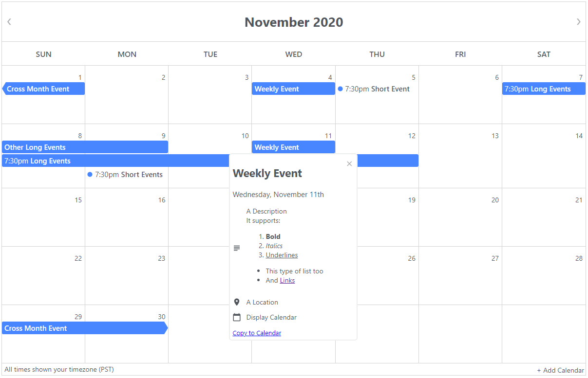

# React Google Calendar

 [](https://travis-ci.com/ericz1803/react-google-calendar)   
  
A react component that displays an event calendar using data from google's calendar api. It is intended to replace the embedded google calendar.

It handles reccuring events, deleted events, and changed events. It also handles and displays events of all lengths in a very similar way to google calendar.

See it in action [here](https://ericz1803.github.io/react-test-calendar/).



Design inspired by [this calendar](https://codepen.io/knyttneve/pen/QVqyNg) and [google calendar](https://www.google.com/calendar).

## Installation

```
1. npm install --save react react-dom @emotion/core
2. npm install --save @ericz1803/google-react-calendar
```

## Usage

First, get an api key from [here](https://developers.google.com/calendar/quickstart/js) by following step 1.

Alternately, you can go to https://console.developers.google.com/flows/enableapi?apiid=calendar.

Then, get the calendar id from the google calendar. It will look something like `09opmkrjova8h5k5k46fedmo88@group.calendar.google.com`.   
You can find it by going to a calendar's settings and scrolling down to the section that is labelled `Integrate calendar`.

### Example

```js
import Calendar from "@ericz1803/react-google-calendar";

const API_KEY = "YOUR_API_KEY";
const CALENDAR_ID = "YOUR_CALENDAR_ID";

class Example extends React.Component {
  render() {
    let styles = {
      
    }

    return (
      <div>
        <Calendar apiKey={API_KEY} calendarId={CALENDAR_ID} styles={styles} />
      </div>
    )
  }
}
```

### Properties
| Parameter     | Type    | Description                                      | Default |
|---------------|---------|--------------------------------------------------|---------|
| `apiKey`      | string  | google api key (required)                        |         |
| `calendarId`  | string  | google calendar id (required)                    |         |
| `styles`      | object  | styles (optional, see more below)                |         |
| `showArrow`   | boolean | shows arrow for events that span multiple months | `true`  |

### Customization

You can change the color of different aspects of the calendar by passing in a `styles` object. Each of the styles in the `styles` object should be an object style (the same as react inline styles) or  an emotion `css` string style ([see more here](https://emotion.sh/docs/css-prop)). If you choose to use emotion's `css` string styles, make sure to `import { css } from "@emotion/core"`.

#### Style Keys
- `calendar`
- `day`
- `today`
- `tooltip`
- `event`
- `eventText`
- `eventCircle`
- `multiEvent`

#### Default Styles


## License
MIT License